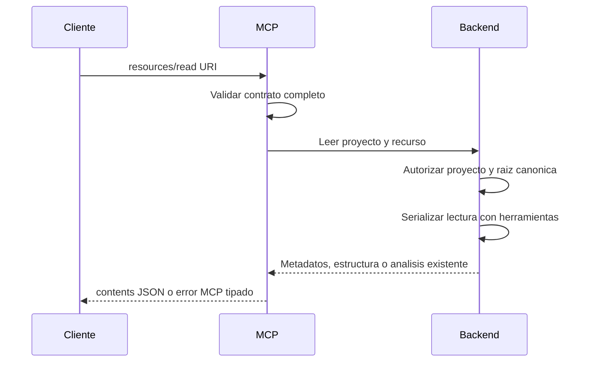

# Lectura

```mermaid
sequenceDiagram
  participant C as Cliente
  participant M as MCP
  participant B as Backend
  C->>M: resources/read URI
  M->>M: Validar contrato completo
  M->>B: Leer proyecto y recurso
  B->>B: Autorizar proyecto y raiz canonica
  B->>B: Serializar lectura con herramientas
  B-->>M: Metadatos, estructura o analisis existente
  M-->>C: contents JSON o error MCP tipado
```
